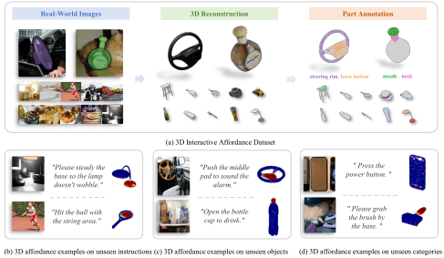
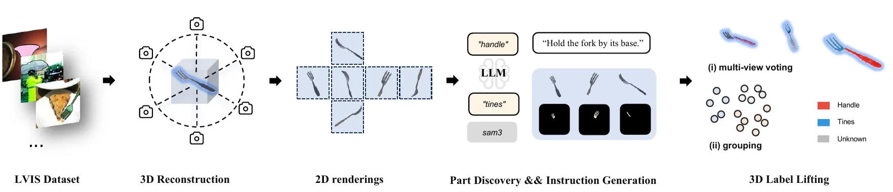
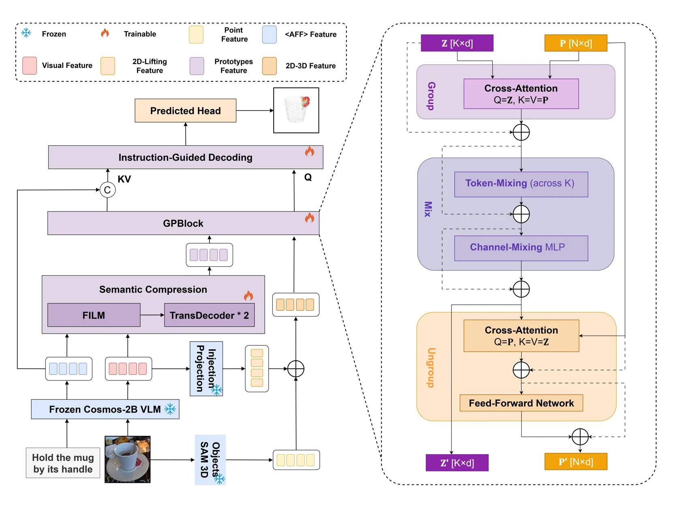

<h1 align="center">AffordAny</h1>

<p align="center">
  <strong>Open-World 3D Affordance Grounding from Monocular RGB Images<br />via Vision-Language-Guided Geometric Reasoning</strong>
</p>

<p align="center">
  <a href="https://arxiv.org/abs/2608.20720">Paper</a> |
  <a href="https://lzlfwow.github.io/AffordAny/">Project Page</a> |
  <a href="https://www.modelscope.cn/datasets/lzlfwow/AffordAny">Dataset</a>
</p>



AffordAny converts a monocular RGB image and a free-form interaction
instruction into an affordance heatmap over a reconstructed 3D object. This
repository contains the dataset construction pipeline, the supervised
AffordAny decoder, and the pseudo-label self-training extension described in
the paper. The benchmark contains 5,334 objects, 10,633 validated part samples,
and 31,899 generated instruction pairs across 473 LVIS categories.

## News

- **2026-08-26:** The [paper](https://arxiv.org/abs/2608.20720) and
  [AffordAny dataset](https://www.modelscope.cn/datasets/lzlfwow/AffordAny) are
  available.

## Repository layout

```text
AffordAny/
|-- research/pipeline/                         # Dataset construction (M0-M11)
|-- models/affordance_decoder_vlm_backbone_cosmos2b_v5/
|   |-- src/                                   # AffordAny decoder
|   `-- scripts/                               # Train and evaluate
|-- models/affordance_decoder_selftraining_v1/
|   |-- src/                                   # Pseudo-label training losses/data
|   `-- scripts/                               # Manifest builder and training
|-- project-page/                              # Interactive paper and dataset demo
|-- data/README.md                             # Dataset placement instructions
|-- third_party/README.md                      # External dependency setup
|-- scripts/check_release.py                   # Pre-publication checks
`-- repo_layout.py                             # Portable repository paths
```

Generated datasets, feature caches, checkpoints, logs, and experiment-only
visualizations are intentionally excluded from Git. Model checkpoints are not
included in the initial release.

## Installation

Create a Python environment and install the lightweight dependencies:

```bash
python -m venv .venv
source .venv/bin/activate
pip install --upgrade pip
pip install -r requirements.txt
```

CUDA-enabled PyTorch should be installed for the CUDA version on your system.
The reconstruction and segmentation stages additionally require SAM 3 and
SAM 3D Objects; see `third_party/README.md`.

## Dataset

The released benchmark is hosted on
[ModelScope](https://www.modelscope.cn/datasets/lzlfwow/AffordAny).

| Objects | Validated parts | Instructions | Categories | Part types |
| ---: | ---: | ---: | ---: | ---: |
| 5,334 | 10,633 | 31,899 | 473 | 678 |



To construct the dataset from source data, prepare LVIS annotations and images
under `data/lvis/`, then run the two-stage pipeline from the repository root:

```bash
python research/pipeline/module_real_lvis_runner/run_real_lvis_pipeline.py \
  stage1 --run-name example --limit 20
python research/pipeline/module_real_lvis_runner/run_real_lvis_pipeline.py \
  stage2 --run-name example
```

Stages using language or vision-language APIs read credentials from
`GEMINI_API_KEY` (and optionally `GEMINI_BASE_URL`) or `GOOGLE_API_KEY`.
Credentials must be provided through the environment and are never stored in
the repository.

## Supervised training and evaluation

The model consumes precomputed geometry and VLM caches. Once the released
cache bundle is downloaded, run:

```bash
bash models/affordance_decoder_vlm_backbone_cosmos2b_v5/scripts/train_v6_tuned.sh \
  /path/to/vlm_cache /path/to/output

python models/affordance_decoder_vlm_backbone_cosmos2b_v5/scripts/evaluate.py \
  --checkpoint /path/to/checkpoint.pt \
  --manifest /path/to/vlm_cache/test_unseen_object_seen_instruction_manifest.json \
  --output-json /path/to/metrics.json
```

Use `python .../train.py --help` and `python .../evaluate.py --help` for all
configuration options.



## Pseudo-label self-training

```bash
bash models/affordance_decoder_selftraining_v1/scripts/run_selftraining_round9.sh \
  /path/to/real_vlm_cache \
  /path/to/pseudo_vlm_cache \
  /path/to/initial_checkpoint.pt \
  /path/to/output
```

The self-training implementation supports confidence-weighted pseudo labels,
uncertainty masking, EMA, curriculum scheduling, and pseudo-label refresh.

## Project page

The interactive project page lives in `project-page/`. It uses the paper's
figures for visual consistency and includes a dataset explorer, architecture
overview, and benchmark results.

```bash
cd project-page
npm install
npm run dev
```

Pushes that modify the page trigger the GitHub Pages deployment workflow.

## Release checks

Run the lightweight checks before every public push:

```bash
python scripts/check_release.py
python -m unittest discover -s tests -v
python -m compileall -q .
```

## Citation

```bibtex
@misc{wu2026affordanyopenworld3daffordance,
      title={AffordAny: Open-World 3D Affordance Grounding from Monocular RGB Images via Vision-Language-Guided Geometric Reasoning},
      author={Junqi Wu and Kaihua Tang and Xuanwen Chen and Hongzhi Li and Jianqiang Huang and Xian-Sheng Hua},
      year={2026},
      eprint={2608.20720},
      archivePrefix={arXiv},
      primaryClass={cs.CV},
      url={https://arxiv.org/abs/2608.20720},
}
```

## License

The source code is released under the [Apache License 2.0](LICENSE). Dataset
assets are distributed separately under the terms documented by the dataset
release.
